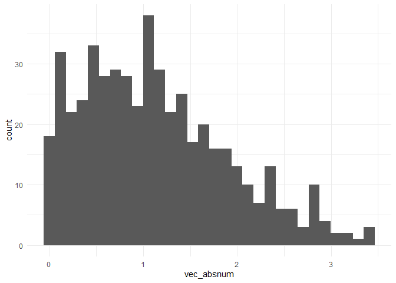

Simple document
================
Waveley Qiu
2021-09-16

I’m an R Markdown document!

# Section 1

Here’s a **code chunk** that samples from a *normal distribution*:

``` r
samp = rnorm(100)
length(samp)
```

    ## [1] 100

# Section 2

I can take the mean of the sample, too! The mean is -0.0055341.

# Section 3

Let’s write a new code chunk.

This code chunk imports the `tidyverse`, creates a data frame and makes
a histogram.

``` r
set.seed(1234)

plot_df = 
  tibble(
    x = rnorm(1000, sd = 0.5),
    y = 1 + 2*x + rnorm(1000),
    y_quad = 1 + 2 * x^2 + rnorm(1000)
  )
plot_df
## # A tibble: 1,000 x 3
##         x      y  y_quad
##     <dbl>  <dbl>   <dbl>
##  1 -0.604 -1.41   0.755 
##  2  0.139  1.58   0.939 
##  3  0.542  0.545  1.48  
##  4 -1.17  -0.710  4.94  
##  5  0.215  2.13  -0.564 
##  6  0.253 -0.400  0.0824
##  7 -0.287  1.36  -0.575 
##  8 -0.273  0.229  1.66  
##  9 -0.282 -0.238  0.713 
## 10 -0.445  0.556 -0.443 
## # ... with 990 more rows
ggplot(plot_df, aes(x = x)) + geom_histogram()
```

<!-- -->

``` r
ggplot(plot_df,aes(x = x, y = y)) + geom_point()
```

<!-- -->

``` r
ggsave("output/scatterplot.pdf", height = 4, width = 6)
```

# Section 4

This is the learning assessment from the course website.

``` r
set.seed(20210916)
plot_df2 <-
  tibble(
    vec_rand = rnorm(500, mean = 1),
    vec_log = vec_rand > 0,
    vec_absnum = abs(vec_rand)
  )

ggplot(data = plot_df2, aes(x = vec_absnum)) + geom_histogram() + theme_minimal()
## `stat_bin()` using `bins = 30`. Pick better value with `binwidth`.
```

<!-- -->

``` r
round(median(plot_df2$vec_absnum), 2)
## [1] 1.05
```

The rounded median of the absolute values of the random sample from the
normal distribution is 1.05.

# YAML header options for html\_document output

output: html\_document: toc: TRUE toc\_float: TRUE code\_folding: hide
